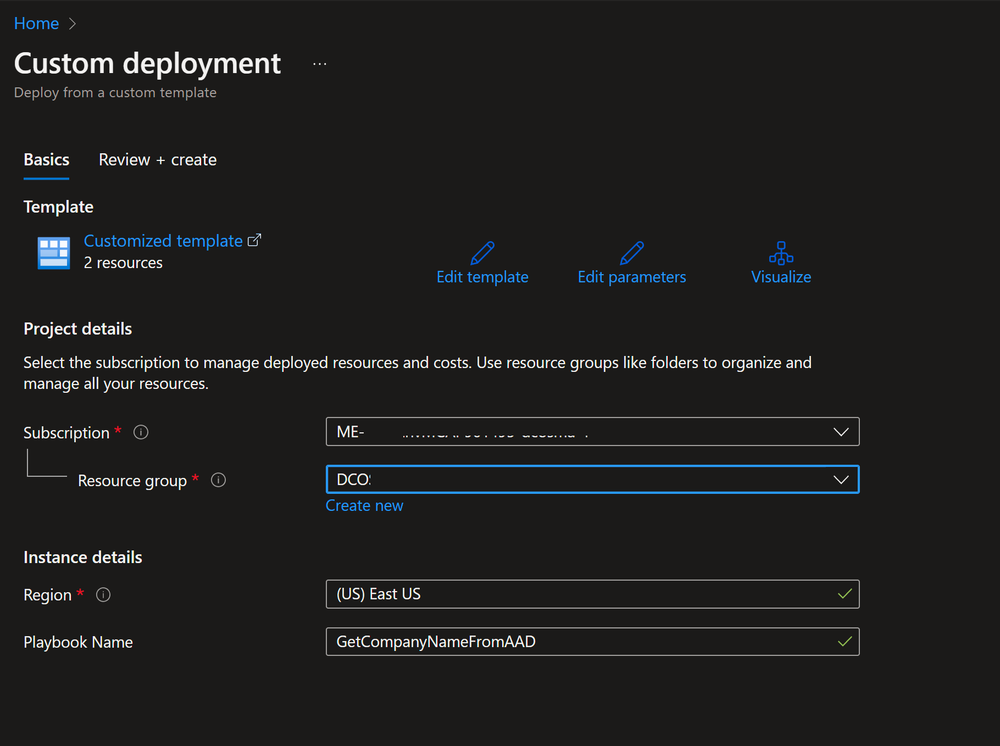
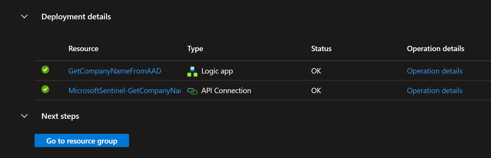
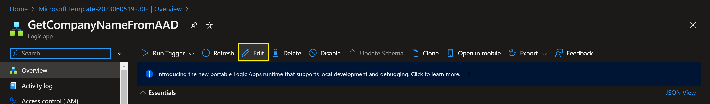
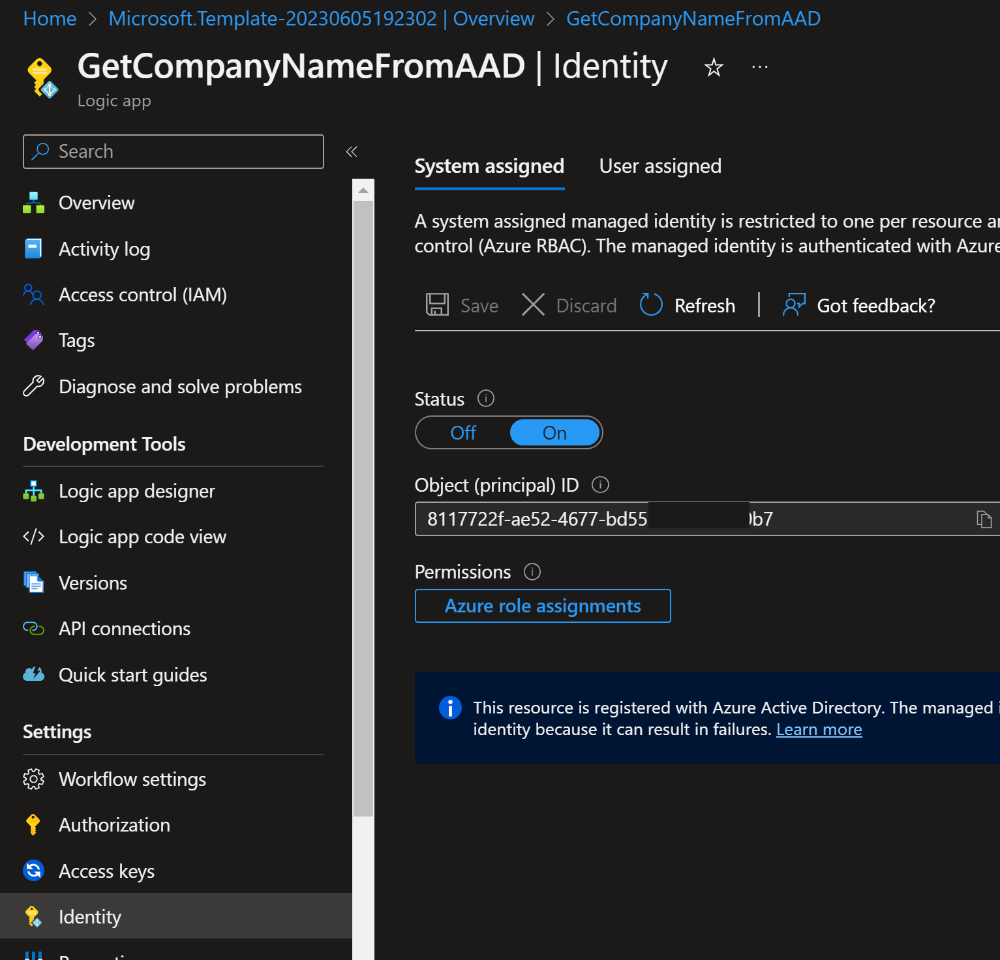
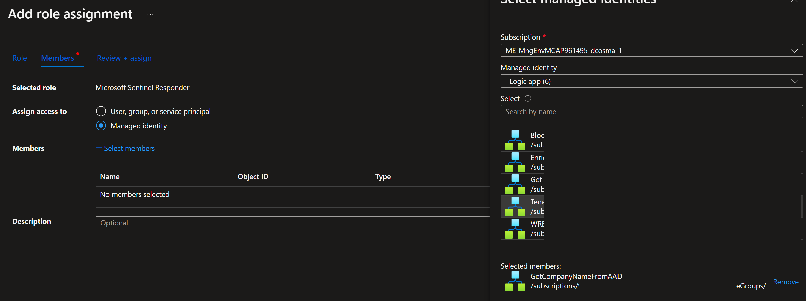
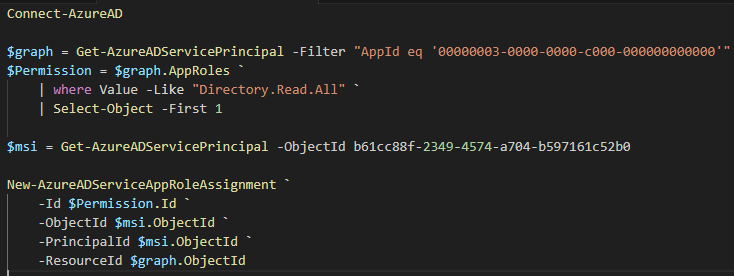

# Get-AzureAD-CompanyName
Author: dragoscosma 👋     

For any technical questions, please contact dcosma@microsoft.com  

This playbook is intended to be automated from Microsoft Sentinel. It will get the CompanyName attribute for every user listed as an entity in the Sentinel Incident and post the value as a tag in the same Sentinel Incident.enable the Azure AD user accounts associated with the entities from Microsoft Sentinel incidents. 

#
### Recommendations:
<h5 align="left"><ul><li>Use a system assigned managed Identity. Location: Logic App - Identity - System assigned - Status: "On"</li></ul></h5>
<h5 align="left"><ul><li>Permissions: Assign Sentinel Responder role and Directory.Read.All to the system assigned identity</li></ul></h5>
<h6 align="left"><ul><i>Note: Sentinel Responder role will be an Azure RBAC permission and Directory.Read.All is an AAD permission.</ul></i></h6>

#
### Deployment

Click the “**Deploy to Azure**” button and it will bring you to the custom deployment template.

In the **Project details** section:

* Select the **Subscription** and **Resource group** from the dropdown boxes you would like the playbook deployed to.  

In the **Instance details** section:  
                                                  
* **Playbook Name**: This can be left as "**GetCompanyNameFromAAD**" or you may change it. 

Towards the bottom, click on "**Review + create**". 

Once the resources have validated, click on "**Create**".

The resources should take around a minute to deploy. Once the deployment is complete, you can expand the "**Deployment details**" section to view them.
Click the one corresponding to the Logic App.

Click on the "**Edit**" button. This will bring us into the Logic Apps Designer.

Before the playbook can be run, the Azure AD and Sentinel connection will either need to be authorized in the indicated step, or an existing authorized connection may be alternatively selected. 

Create a system assigned managed Identity. Under the Logic App click on: "Identity" - "System assigned", "On". Copy the Object ID.

In Azure assign this Identity the needed Azure role: Microsoft Sentinel Responder.
Azure - Subscription - IAM - Add - Add role assignment - choose: "Microsoft Sentinel Responder" - next - under members select: Managed Identity and then choose: "select members".
Here, choose under managed identity: "Logic app" and then select the newly created app.

For the Azure AD permissions, you need to use PowerShell.
Commands:
Connect-AzureAD

$graph = Get-AzureADServicePrincipal -Filter "AppId eq '00000003-0000-0000-c000-000000000000'"
$Permission = $graph.AppRoles `
    | where Value -Like "Directory.Read.All" `
    | Select-Object -First 1

$msi = Get-AzureADServicePrincipal -ObjectId b61cc88f-2349-4574-a704-b597161c52b0

New-AzureADServiceAppRoleAssignment `
    -Id $Permission.Id `
    -ObjectId $msi.ObjectId `
    -PrincipalId $msi.ObjectId `
    -ResourceId $graph.ObjectId

 
 

